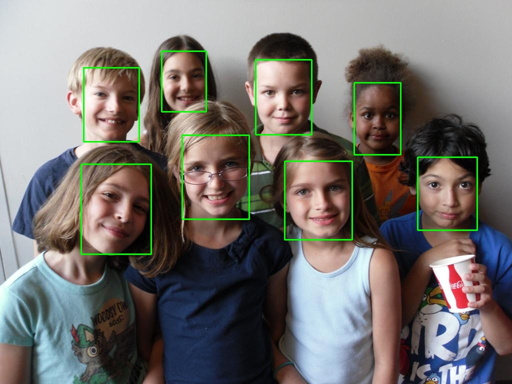

# Tengine 人脸检测X86版本

## 环境
**System**: Ubuntu18.04

**CMAKE**: 3.15.3

## 准备

1. 把[第0篇-Tengine X86版本编译](https://zhuanlan.zhihu.com/p/181579203)中编译好的so和头文件复制到项目目录中的tengine目录
2. 把[第2篇-Tengine 转换模型](https://zhuanlan.zhihu.com/p/187387769)中转化好的模型复制到项目目录中的models目录
3. 复制[https://github.com/Linzaer/Ultra-Light-Fast-Generic-Face-Detector-1MB/tree/master/MNN/imgs](https://github.com/Linzaer/Ultra-Light-Fast-Generic-Face-Detector-1MB/tree/master/MNN/imgs)到项目目录

这个时候的目录结构应该是这样

```
├── imgs
│   ├── 1.jpg
│   ├── 2.jpg
│   ├── 3.jpg
│   └── 4.jpg
├── models
│   └── version-RFB-320_simplified.tmfile
└── tengine
    ├── include
    │   └── tengine_c_api.h
    └── lib
        └── libtengine-lite.so
```

## Coding

### 头文件
```c++
#ifndef UltraFace_hpp
#define UltraFace_hpp

#pragma once

#include "tengine_c_api.h"
#include <opencv2/opencv.hpp>
#include <algorithm>
#include <iostream>
#include <string>
#include <vector>
#include <memory>
#include <chrono>

#define num_featuremap 4
#define hard_nms 1
#define blending_nms 2 /* mix nms was been proposaled in paper blaze face, aims to minimize the temporal jitter*/
typedef struct FaceInfo {
    float x1;
    float y1;
    float x2;
    float y2;
    float score;

} FaceInfo;

class UltraFace {
public:
    UltraFace(const std::string &tengine_path,
              int input_width, int input_length, int num_thread_ = 4, float score_threshold_ = 0.7, float iou_threshold_ = 0.3,
              int topk_ = -1);

    ~UltraFace();

    int detect(cv::Mat &img, std::vector<FaceInfo> &face_list);

private:
    void generateBBox(std::vector<FaceInfo> &bbox_collection, tensor_t scores, tensor_t boxes);

    void nms(std::vector<FaceInfo> &input, std::vector<FaceInfo> &output, int type = blending_nms);

    void get_input_data_cv(const cv::Mat& sample, float* input_data, int img_h, int img_w, const float* mean, const float* scale, int swapRB = 0);

private:

    graph_t graph = nullptr;
    tensor_t input_tensor = nullptr;

    int num_thread;
    int image_w;
    int image_h;

    int in_w;
    int in_h;
    int num_anchors;

    float score_threshold;
    float iou_threshold;


    const float mean_vals[3] = {127, 127, 127};
    const float norm_vals[3] = {1.0 / 128, 1.0 / 128, 1.0 / 128};

    const float center_variance = 0.1;
    const float size_variance = 0.2;
    const std::vector<std::vector<float>> min_boxes = {
            {10.0f,  16.0f,  24.0f},
            {32.0f,  48.0f},
            {64.0f,  96.0f},
            {128.0f, 192.0f, 256.0f}};
    const std::vector<float> strides = {8.0, 16.0, 32.0, 64.0};
    std::vector<std::vector<float>> featuremap_size;
    std::vector<std::vector<float>> shrinkage_size;
    std::vector<int> w_h_list;

    std::vector<std::vector<float>> priors = {};
};

#endif /* UltraFace_hpp */
```

### 实现

```c++
#define clip(x, y) (x < 0 ? 0 : (x > y ? y : x))

#include "UltraFace.hpp"

using namespace std;

UltraFace::UltraFace(const std::string &tengine_path,
                     int input_width, int input_length, int num_thread_,
                     float score_threshold_, float iou_threshold_, int topk_) {
    num_thread = num_thread_;
    score_threshold = score_threshold_;
    iou_threshold = iou_threshold_;
    in_w = input_width;
    in_h = input_length;
    w_h_list = {in_w, in_h};

    for (auto size : w_h_list) {
        std::vector<float> fm_item;
        for (float stride : strides) {
            fm_item.push_back(ceil(size / stride));
        }
        featuremap_size.push_back(fm_item);
    }

    for (auto size : w_h_list) {
        shrinkage_size.push_back(strides);
    }
    /* generate prior anchors */
    for (int index = 0; index < num_featuremap; index++) {
        float scale_w = in_w / shrinkage_size[0][index];
        float scale_h = in_h / shrinkage_size[1][index];
        for (int j = 0; j < featuremap_size[1][index]; j++) {
            for (int i = 0; i < featuremap_size[0][index]; i++) {
                float x_center = (i + 0.5) / scale_w;
                float y_center = (j + 0.5) / scale_h;

                for (float k : min_boxes[index]) {
                    float w = k / in_w;
                    float h = k / in_h;
                    priors.push_back({clip(x_center, 1), clip(y_center, 1), clip(w, 1), clip(h, 1)});
                }
            }
        }
    }
    /* generate prior anchors finished */

    num_anchors = priors.size();

    if (init_tengine() != 0)
    {
        fprintf(stderr, "Initial tengine failed.\n");
        exit(0);
    }

    cout<<tengine_path<<endl;
    graph = create_graph(nullptr, "tengine", tengine_path.c_str());


    int dims[] = {1, 3, 240, 320};

    input_tensor = get_graph_tensor(graph, "input");


    if (nullptr == input_tensor)
    {
        printf("Get input tensor failed\n");
        exit(0);
    }

    if (0 != set_tensor_shape(input_tensor, dims, 4))
    {
        printf("Set input tensor shape failed\n");
        exit(0);
    }

    if (0 != prerun_graph(graph))
    {
        printf("Pre-run graph failed\n");
        exit(0);
    }

}

UltraFace::~UltraFace() {
    release_graph_tensor(input_tensor);
    postrun_graph(graph);
    destroy_graph(graph);
    release_tengine();
}

int UltraFace::detect(cv::Mat &raw_image, std::vector<FaceInfo> &face_list) {
    if (raw_image.empty()) {
        std::cout << "image is empty ,please check!" << std::endl;
        return -1;
    }

    image_h = raw_image.rows;
    image_w = raw_image.cols;

    int img_size      = in_w * in_h * 3;
    float* input_data = ( float* )malloc(img_size * sizeof(float));
    get_input_data_cv(raw_image, input_data, in_w, in_h, mean_vals, norm_vals, 0);

    if (set_tensor_buffer(input_tensor, input_data, (in_w * in_h * 3) * 4) < 0)
    {
        printf("Set input tensor buffer failed\n");
        return -1;
    }

    auto start = chrono::steady_clock::now();


    // run network
    if (run_graph(graph, 1) < 0)
    {
        printf("Run graph failed\n");
        return -1;
    }

    // get output data

    string scores = "scores";
    string boxes = "boxes";
    tensor_t tensor_scores = get_graph_tensor(graph, scores.c_str());
    tensor_t tensor_boxes = get_graph_tensor(graph, boxes.c_str());

    std::vector<FaceInfo> bbox_collection;


    auto end = chrono::steady_clock::now();
    chrono::duration<double> elapsed = end - start;
    cout << "inference time:" << elapsed.count() << " s" << endl;

    generateBBox(bbox_collection, tensor_scores, tensor_boxes);
    nms(bbox_collection, face_list);

    free(input_data);

    return 0;
}

void UltraFace::generateBBox(std::vector<FaceInfo> &bbox_collection, tensor_t scores, tensor_t boxes) {
    float* scores_blob = ( float* )get_tensor_buffer(scores);
    float* boxes_blob = ( float* )get_tensor_buffer(boxes);
    for (int i = 0; i < num_anchors; i++) {
        if (scores_blob[i * 2 + 1] > score_threshold) {
            FaceInfo rects;
            float x_center = boxes_blob[i * 4] * center_variance * priors[i][2] + priors[i][0];
            float y_center = boxes_blob[i * 4 + 1] * center_variance * priors[i][3] + priors[i][1];
            float w = exp(boxes_blob[i * 4 + 2] * size_variance) * priors[i][2];
            float h = exp(boxes_blob[i * 4 + 3] * size_variance) * priors[i][3];

            rects.x1 = clip(x_center - w / 2.0, 1) * image_w;
            rects.y1 = clip(y_center - h / 2.0, 1) * image_h;
            rects.x2 = clip(x_center + w / 2.0, 1) * image_w;
            rects.y2 = clip(y_center + h / 2.0, 1) * image_h;
            rects.score = clip(scores_blob[i * 2 + 1], 1);
            bbox_collection.push_back(rects);
        }
    }
}

void UltraFace::nms(std::vector<FaceInfo> &input, std::vector<FaceInfo> &output, int type) {
    std::sort(input.begin(), input.end(), [](const FaceInfo &a, const FaceInfo &b) { return a.score > b.score; });

    int box_num = input.size();

    std::vector<int> merged(box_num, 0);

    for (int i = 0; i < box_num; i++) {
        if (merged[i])
            continue;
        std::vector<FaceInfo> buf;

        buf.push_back(input[i]);
        merged[i] = 1;

        float h0 = input[i].y2 - input[i].y1 + 1;
        float w0 = input[i].x2 - input[i].x1 + 1;

        float area0 = h0 * w0;

        for (int j = i + 1; j < box_num; j++) {
            if (merged[j])
                continue;

            float inner_x0 = input[i].x1 > input[j].x1 ? input[i].x1 : input[j].x1;
            float inner_y0 = input[i].y1 > input[j].y1 ? input[i].y1 : input[j].y1;

            float inner_x1 = input[i].x2 < input[j].x2 ? input[i].x2 : input[j].x2;
            float inner_y1 = input[i].y2 < input[j].y2 ? input[i].y2 : input[j].y2;

            float inner_h = inner_y1 - inner_y0 + 1;
            float inner_w = inner_x1 - inner_x0 + 1;

            if (inner_h <= 0 || inner_w <= 0)
                continue;

            float inner_area = inner_h * inner_w;

            float h1 = input[j].y2 - input[j].y1 + 1;
            float w1 = input[j].x2 - input[j].x1 + 1;

            float area1 = h1 * w1;

            float score;

            score = inner_area / (area0 + area1 - inner_area);

            if (score > iou_threshold) {
                merged[j] = 1;
                buf.push_back(input[j]);
            }
        }
        switch (type) {
            case hard_nms: {
                output.push_back(buf[0]);
                break;
            }
            case blending_nms: {
                float total = 0;
                for (int i = 0; i < buf.size(); i++) {
                    total += exp(buf[i].score);
                }
                FaceInfo rects;
                memset(&rects, 0, sizeof(rects));
                for (int i = 0; i < buf.size(); i++) {
                    float rate = exp(buf[i].score) / total;
                    rects.x1 += buf[i].x1 * rate;
                    rects.y1 += buf[i].y1 * rate;
                    rects.x2 += buf[i].x2 * rate;
                    rects.y2 += buf[i].y2 * rate;
                    rects.score += buf[i].score * rate;
                }
                output.push_back(rects);
                break;
            }
            default: {
                printf("wrong type of nms.");
                exit(-1);
            }
        }
    }
}

void UltraFace::get_input_data_cv(const cv::Mat& sample, float* input_data, int img_w, int img_h, const float* mean, const float* scale, int swapRB)
{
    cv::Mat img;
    if(sample.channels() == 4)
    {
        cv::cvtColor(sample, img, cv::COLOR_BGRA2BGR);
    }
    else if(sample.channels() == 1)
    {
        cv::cvtColor(sample, img, cv::COLOR_GRAY2BGR);
    }
    else if(sample.channels() == 3 && swapRB == 1)
    {
        cv::cvtColor(sample, img, cv::COLOR_BGR2RGB);
    }
    else
    {
        img = sample;
    }

    cv::resize(img, img, cv::Size(img_w, img_h));
    img.convertTo(img, CV_32FC3);
    float* img_data = ( float* )img.data;
    int hw = img_w * img_h;
    for(int w = 0; w < img_w; w++)
    {
        for(int h = 0; h < img_h; h++)
        {
            for(int c = 0; c < 3; c++)
            {
                input_data[c * hw + w * img_h + h] = (*img_data - mean[c]) * scale[c];
                img_data++;
            }
        }
    }
}
```

### 调用
```c++
#include "UltraFace.hpp"
#include <iostream>
#include <opencv2/opencv.hpp>

using namespace std;

int main(int argc, char **argv) {
    if (argc <= 2) {
        fprintf(stderr, "Usage: %s <tengine .tengine> [image files...]\n", argv[0]);
        return 1;
    }

    string tengine_path = argv[1];
    UltraFace ultraface(tengine_path, 320, 240, 4, 0.65); // config model input

    for (int i = 2; i < argc; i++) {
        string image_file = argv[i];
        cout << "Processing " << image_file << endl;

        cv::Mat frame = cv::imread(image_file);
        auto start = chrono::steady_clock::now();
        vector<FaceInfo> face_info;
        ultraface.detect(frame, face_info);

        cout << "face_info " << face_info.size() << endl;

        for (auto face : face_info) {
            cv::Point pt1(face.x1, face.y1);
            cv::Point pt2(face.x2, face.y2);
            cv::rectangle(frame, pt1, pt2, cv::Scalar(0, 255, 0), 2);
        }

        auto end = chrono::steady_clock::now();
        chrono::duration<double> elapsed = end - start;
        cout << "all time: " << elapsed.count() << " s" << endl;
        // cv::imshow("UltraFace", frame);
        // cv::waitKey();
        string result_name = "result" + to_string(i) + ".jpg";
        cv::imwrite(result_name, frame);
    }
    return 0;
}
```

具体实现就不讲了，比较简单就是对模型的调用，代码参考[https://github.com/Linzaer/Ultra-Light-Fast-Generic-Face-Detector-1MB/tree/master/MNN](https://github.com/Linzaer/Ultra-Light-Fast-Generic-Face-Detector-1MB/tree/master/MNN)

### 编写 CMakeLists.txt

```cmake
cmake_minimum_required(VERSION 3.10)
project(Ultra-face-tengine)

set(CMAKE_CXX_STANDARD 11)

find_package(OpenCV REQUIRED)
include_directories(tengine/include/)

add_library(tengine SHARED IMPORTED)
set_target_properties(tengine PROPERTIES IMPORTED_LOCATION ${CMAKE_SOURCE_DIR}/tengine/lib/libtengine-lite.so)

add_executable(Ultra-face-tengine src/main.cpp src/UltraFace.cpp)
target_link_libraries(Ultra-face-tengine tengine ${OpenCV_LIBS})
```

## 编译

```bash
mkdir build
cd build
cmake ..
make -j4
```
**这边已经默认编译的电脑已经安装OPENCV，如果尚未安装，就百度一篇教程安装下，这个比较简单**

## 测试

```
./build/Ultra-face-tengine /home/oal/ssd_data/workspace/Tengine_Tutorial/2_FaceDetector/models/version-RFB-320_simplified.tmfile ./imgs/1.jpg 
```
输出
```
Processing ./imgs/1.jpg
inference time:0.0213569 s
face_info 8
all time: 0.0234363 s
```
人脸已经被检测出来了，我们来看下结果

## 结果


